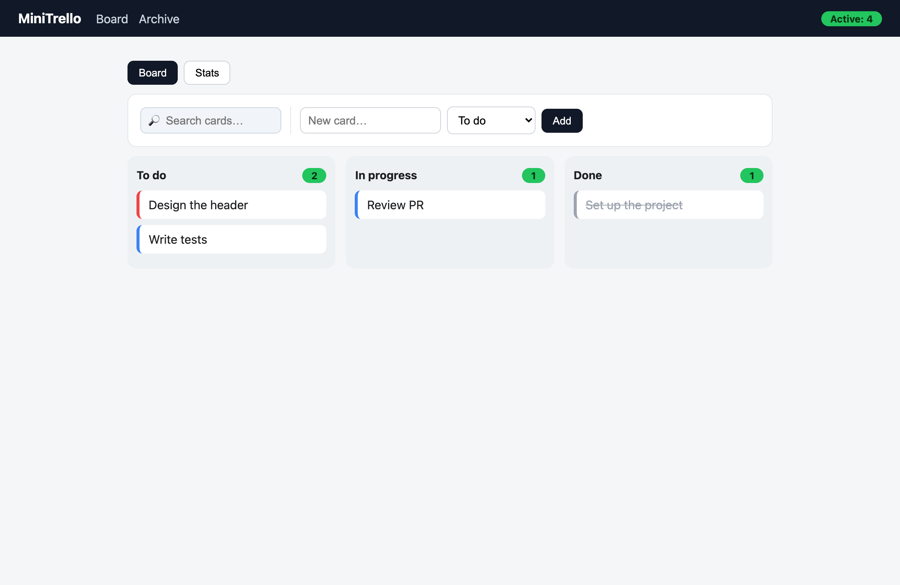
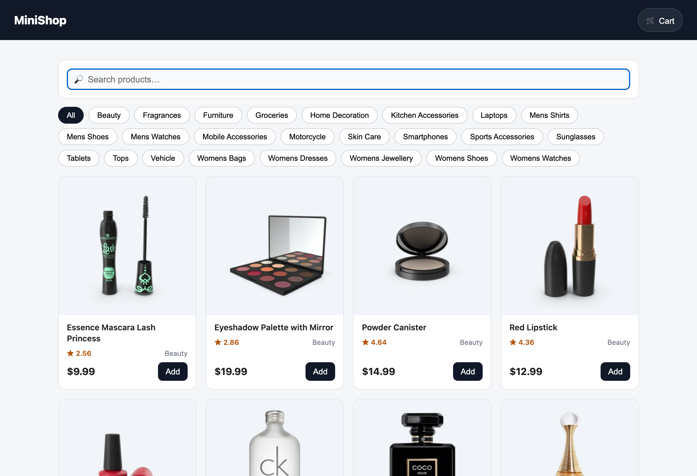
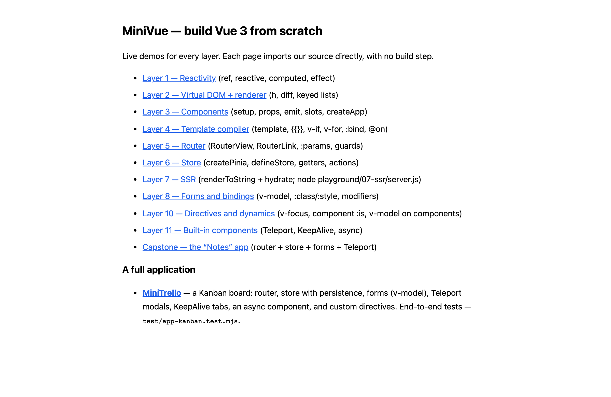

<div align="center">

# MiniVue

### Build Vue 3 from scratch

Reactivity, virtual DOM, the template compiler, components, router, store and SSR —
rebuilt one readable layer at a time.<br>
**Pure ESM · zero build step · zero runtime dependencies**

[](https://github.com/sirserik/minivue-from-scratch/actions/workflows/ci.yml)
[](test/)
[](package.json)
[](LICENSE)
[](book/)

**[Quick start](#quick-start)** · **[The 12 layers](#whats-inside--12-layers)** · **[The book](#the-book)** · **[Why another mini Vue?](#why-another-mini-vue)** · **[Русский](README.ru.md)**

</div>

MiniVue is a from-scratch reimplementation of Vue 3 **and its whole ecosystem**. No Webpack, no Vite, no TypeScript, no transpiler — just JavaScript modules the browser runs directly. Open a file, import a module, watch it work. Nothing is hidden behind a bundler.

Every subsystem is small enough to read in one sitting, its **API names match real Vue 3 on purpose**, so what you learn transfers to the real framework one-to-one. Each layer ships with working code (`packages/`), tests (`test/`), a live in-browser demo (`playground/`) and a book chapter (`book/`).

**This is not about *using* Vue — it's about how Vue is *built*.**

```js
import { reactive, effect } from './packages/reactivity/index.js'

const state = reactive({ count: 0 })

effect(() => console.log('count is', state.count))  // → "count is 0"
state.count++                                        // → "count is 1"  (auto-reruns)
```

That auto-rerun is ~40 lines of code. By the end you'll know exactly which 40, and why.

<div align="center">
<br>
<sub>The capstone app — a Kanban board with drag-free columns, search, stats, custom directives, Teleport modals and KeepAlive tabs — built entirely on MiniVue.</sub>
</div>

## What's inside — 12 layers

Everything stands on the reactivity core; each layer above adds one capability
the layer under it doesn't have:

```
  apps        examples/kanban  ·  examples/shop  ·  playground/*
                   ▲
  ecosystem   router  ·  store  ·  built-ins  ·  server-renderer
                   ▲
  framework   compiler ─▶ runtime-core (components · VNode · scheduler) ─▶ runtime-dom
                   ▲
  foundation  reactivity  (ref · reactive · effect)   ← everything sits on this
```

| # | Layer | Package | Highlights |
|---|-------|---------|-----------|
| 1 | **Reactivity** | `reactivity` | `ref`, `reactive`, `computed`, `watch`, `effect` |
| 2 | **Virtual DOM** | `runtime-core` · `runtime-dom` | `h`, `createRenderer`, keyed diff via **LIS** |
| 3 | **Components** | `runtime-core` | `setup`, props/emit, slots, lifecycle, `createApp` |
| 4 | **Compiler** | `compiler` | `template` → render function |
| 5 | **Router** | `router` | `createRouter`, `RouterView`, `RouterLink` |
| 6 | **Store** | `store` | `createPinia`, `defineStore` (a mini-Pinia) |
| 7 | **SSR** | `server-renderer` | `renderToString` + client hydration |
| 8 | **Forms & binding** | | `v-model`, object/array `:class`/`:style`, `.stop/.prevent/.enter` modifiers |
| 9 | **Reactivity, deeper** | | `watchEffect`, `readonly`, `shallowRef`, `shallowReactive`, `markRaw` |
| 10 | **Directives** | | custom `v-*` with hooks, `<component :is>`, `v-model` on components |
| 11 | **Built-ins** | | `Teleport`, `KeepAlive`, `defineAsyncComponent` |
| 12 | **Store, deeper** | | `$patch`, `$subscribe`, `$reset` + a capstone app |

All 12 layers are **complete**: **105 passing tests**, browser demos, an SSR server, and two real-world example apps — a **Kanban board** (`examples/kanban`) and a **storefront on a fake REST API** (`examples/shop`), each with a Playwright end-to-end suite.

<div align="center">
<br>
<sub>MiniShop — async data from a fake API (<a href="https://dummyjson.com">DummyJSON</a>), a persisted cart with a Teleport drawer, route-param product pages, and live filtering — all on MiniVue.</sub>
</div>

## Quick start

Requires **Node.js 18+** (only for the test runner and dev server — the framework itself runs in any modern browser with no Node).

```bash
git clone https://github.com/sirserik/minivue-from-scratch
cd minivue-from-scratch

# Run the test suite (Node's built-in runner — no dependencies to install)
npm test

# Live browser demos (layers 1–12)
npm run serve            # → http://localhost:5173/playground/

# SSR example (layer 7): server render + hydration
node playground/07-ssr/server.js   # → http://localhost:5174/

# End-to-end tests of the example apps (headless Chrome)
npm run e2e        # MiniTrello (Kanban)
npm run e2e:shop   # MiniShop (mocked fake API)
```

<div align="center">
<br>
<sub>The playground — a live, buildless demo for every layer.</sub>
</div>

## How to read it

Follow the layers in order — each builds on the last. For every layer:

1. Read the **book chapter** (`book/en/chapters/NN-*.md`) for the *why*.
2. Read the **package** (`packages/<name>/`) for the *how* — it's deliberately tiny.
3. Open the matching **playground demo** and poke at it live.
4. Skim the **test file** to see the exact contract.

```
packages/     framework source — one package per subsystem, mirrors real Vue
playground/   HTML demos that import packages/ directly (ESM, no build)
examples/     two demo apps — kanban/ and shop/ (each with an e2e suite)
test/         105 tests on node:test
book/         the companion book (Markdown → PDF via pandoc + xelatex)
scripts/      dev server for the playground
```

## The book

A full companion book walks through building every layer — from *"what is a reactive variable"* all the way to *"how does SSR hydration work"*, written to be followable **even if you've never written JavaScript before**.

| Ch. | Title | Layer |
|----:|-------|-------|
| 0 | [Why Rebuild Vue from Scratch](book/en/chapters/00-intro.md) | — |
| 0½ | [The JavaScript You'll Need](book/en/chapters/00b-javascript-minimum.md) | — |
| 1 | [Reactivity](book/en/chapters/01-reactivity.md) | `reactivity` |
| 2 | [The Virtual DOM and the Renderer](book/en/chapters/02-vdom.md) | `runtime-core` · `runtime-dom` |
| 3 | [Components](book/en/chapters/03-components.md) | `runtime-core` |
| 4 | [The Template Compiler](book/en/chapters/04-compiler.md) | `compiler` |
| 5 | [The Router](book/en/chapters/05-router.md) | `router` |
| 6 | [The Store](book/en/chapters/06-store.md) | `store` |
| 7 | [SSR and Hydration](book/en/chapters/07-ssr.md) | `server-renderer` |
| 8 | [Forms and Bindings](book/en/chapters/08-forms.md) | — |
| 9 | [Reactivity, Deeper](book/en/chapters/09-reactivity-extras.md) | `reactivity` |
| 10 | [Directives and Dynamic Components](book/en/chapters/10-directives.md) | — |
| 11 | [Built-in Components](book/en/chapters/11-builtins.md) | — |
| 12 | [Store Deep-Dive and the Capstone App](book/en/chapters/12-capstone.md) | `store` |

The book ships in **two languages that document the same engine** — English (`book/en/`) and Russian (`book/ru/`):

```bash
bash book/build/build-pdf.sh en    # → book/MiniVue-from-scratch-en.pdf
bash book/build/build-pdf.sh ru    # → book/MiniVue-from-scratch-ru.pdf
bash book/build/build-pdf.sh all   # both (default)
```

Requires `pandoc` 3.x and `xelatex` (TeX Live). The two editions stay in lockstep with the code — a pre-commit hook blocks any `packages/` change that doesn't update both books (see [CONTRIBUTING.md](CONTRIBUTING.md)).

## Why another "mini Vue"?

Most from-scratch clones stop at reactivity + a virtual DOM. MiniVue goes the whole distance — **compiler, router, store, SSR, built-ins and a real app** — while keeping every file readable. The API names match Vue 3 exactly, so this doubles as a mental model for the framework you already use at work.

## Contributing

Issues and PRs welcome — especially:
- Polishing the English translation of the book
- More playground demos
- Additional edge-case tests

First, enable the git hooks: `bash scripts/install-hooks.sh`. See [CONTRIBUTING.md](CONTRIBUTING.md) — note that the two book editions must stay in sync with the code.

## License

[MIT](LICENSE) © Serik Muradov. API names intentionally mirror Vue 3 so the knowledge transfers directly. Not affiliated with the Vue team.
